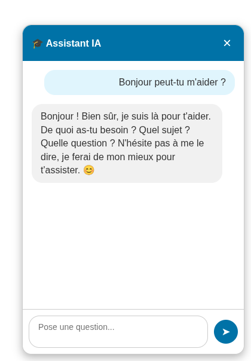

# IAAT Chatbot


Chatbot en popup léger et autonome, compatible avec toute API de type OpenAI, pour intégrer facilement une interface de conversation sur n’importe quel site web.

## Fonctionnalités

-   **Interface de Chat Simple :** Une interface utilisateur responsive et facile à utiliser.
-   **Gestion de l'Historique :** La conversation est conservée pendant la session.
-   **Rendu Markdown :** Les réponses de l'assistant sont formatées à partir de Markdown.
-   **Compatible OpenAI:** Se branche sur LiteLLM ou OpenWeb UI par exemple

## Aperçu



## Installation

### 1. Installation des dépendances JavaScript

-   Assurez-vous d'avoir Node.js 22 et npm 10 installés.
-   Installez les dépendances frontend :
    ```bash
    npm install
    ```
-   Compilez le projet avec :
    ```bash
    npm run build
    ```
-   Les fichiers compilés se trouvent dans le répertoire `dist`

## Utilisation

### Intégration dans un autre site web

Pour intégrer le chatbot dans une autre page HTML, suivez ces étapes :

1.  **Inclure les fichiers depuis unpkg :**
    Le moyen le plus simple d'inclure les fichiers est d'utiliser [unpkg](https://unpkg.com/), un CDN qui sert les fichiers directement depuis le registre npm.

    Dans la section `<head>` de votre page HTML, incluez le fichier CSS :
    ```html
    <link rel="stylesheet" href="https://unpkg.com/@iaat/chatbot@1.0.1/dist/css/chatbot.min.css">
    ```

    Juste avant la balise de fermeture `</body>`, incluez le fichier JavaScript :
    ```html
    <script src="https://unpkg.com/@iaat/chatbot@1.0.1/dist/js/chatbot.min.js"></script>
    ```

2.  **Ajouter la structure HTML du chatbot :**
    Insérez cette structure HTML à l'endroit où vous souhaitez que le chatbot apparaisse dans votre page. L'ID `iaat-chatbot` est crucial.

    ```html
    <div id="iaat-chatbot">
      <button class="cb-chat-toggle" aria-label="Ouvrir le chat">💬</button>
      <div class="cb-chat-popup">
        <header class="cb-chat-header">
          <span>🤖 Chatbot</span>
          <div class="cb-chat-header-buttons">
            <button class="cb-clear-chat" aria-label="Effacer la conversation">⟳</button>
            <button class="cb-close-chat" aria-label="Fermer le chat">×</button>
          </div>
        </header>
        <main class="cb-chat-messages"></main>
        <form class="cb-chat-form">
          <textarea class="cb-chat-input" rows="1" placeholder="Pose une question..." aria-label="Votre message"></textarea>
          <button type="submit" class="cb-chat-send-button" aria-label="Envoyer le message">➤</button>
        </form>
      </div>
    </div>
    ```

3.  **Instancier le Chatbot avec les options de configuration :**
    Après avoir inclus tous les scripts et la structure HTML, instanciez la classe `Chatbot`. Il est **fortement recommandé** de passer les options de configuration directement au constructeur.

    ```html
    <script>
      document.addEventListener('DOMContentLoaded', () => {
        window.chatbotInstance = new IaatChatbot('iaat-chatbot', {
          proxyUrl: "http://127.0.0.1:8000/api/chat", // L'URL de votre backend FastAPI
          accessKey: "VOTRE_CLE_D_ACCES", // Votre clé pour accéder à /api/chat pour éviter les bots
          openByDefault: "true", // "true" pour ouvrir le chat par défaut
          maxConversationLength: 50, // Nombre max de messages à envoyer au backend
          welcomeMessage: "Bonjour ! Comment puis-je vous aider ?", // Message de bienvenue
        });
      });
    </script>
    ```

    *Note :* La classe `IaatChatbot` est rendue disponible globalement via `window.IaatChatbot` après l'inclusion de `chatbot.min.js`. L'utilisation de `DOMContentLoaded` assure que le DOM est entièrement chargé avant d'essayer d'instancier le chatbot.

## Démo

Une page de démonstration est disponible dans le dossier [`demo`](./demo).  
Elle permet de tester et visualiser le fonctionnement du projet directement dans votre navigateur.
